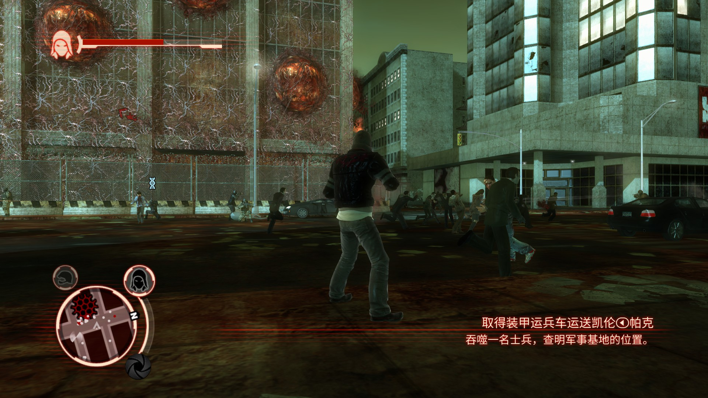
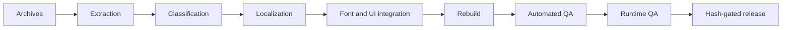
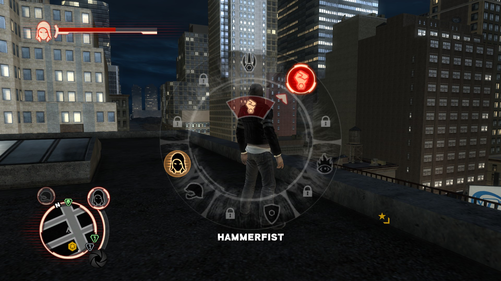
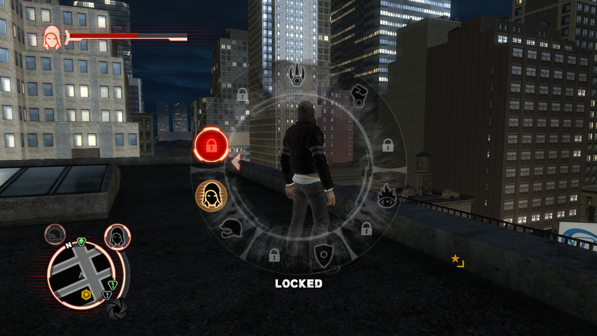
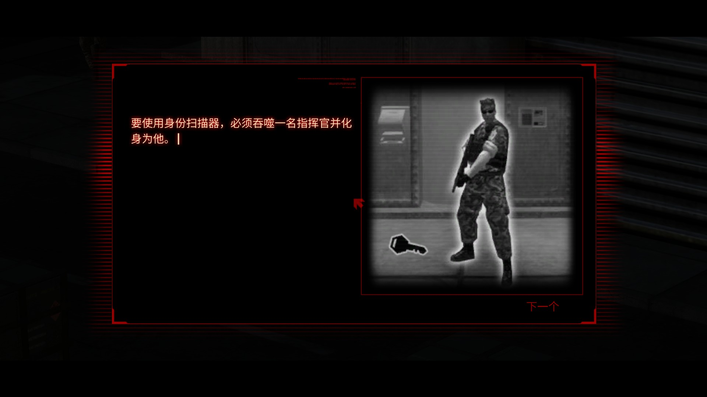
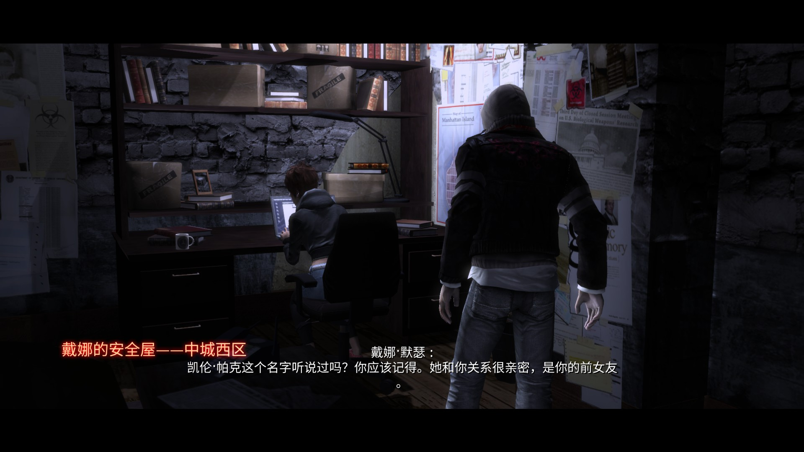
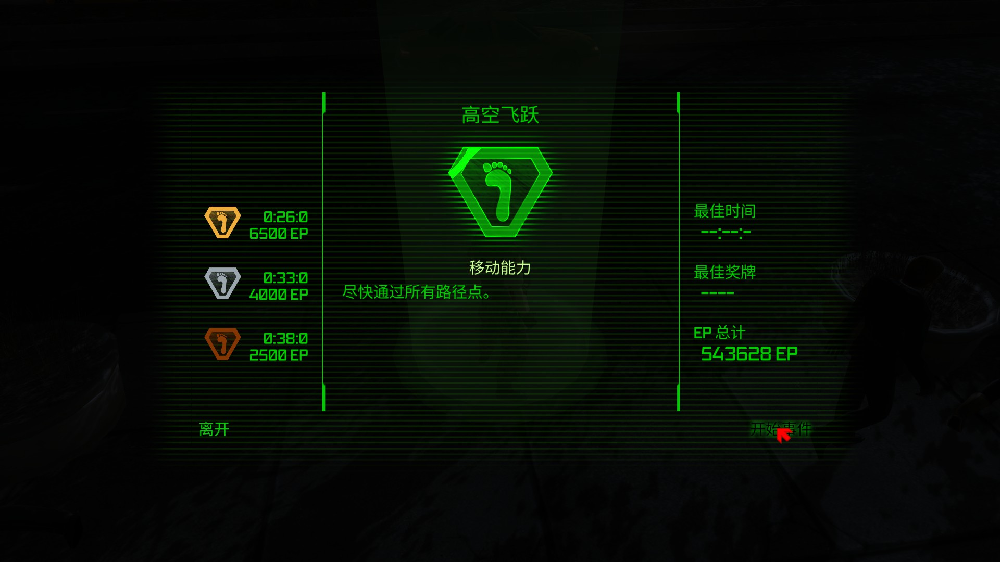

# Prototype 1 Localization Engineering — Case Study #001

I built an end-to-end localization engineering workflow for Prototype 1, covering five legacy text paths and a reproducible nine-archive release. The difficult part was not translation alone: font bindings, Scaleform UI behavior, archive integrity, and state-dependent rendering could each break otherwise valid Chinese text. I set the scope and acceptance criteria, ran the in-game tests, collected failure evidence, and made the compatibility and release decisions. The final v2.3.4 build is frozen with documented fallbacks and no confirmed P0, P1, or P2 issues under the project's release classification.

*Final Simplified Chinese runtime build.*

## What I Built

Player-facing text was distributed across HUD TextBible entries, two dialogue archives, Web of Intrigue memories, and real-time cinematic subtitles. I built a controlled path from extraction and classification through translation integration, font/UI work, archive reconstruction, automated checks, targeted runtime QA, and hash-gated release.

AI assisted with analysis, coding, candidate builds, and documentation. Human judgment remained the control layer: I defined what counted as player-visible, tested failures in the game, selected single-variable experiments, accepted or rejected compatibility compromises, and approved the frozen release.

## Key Results

| Result | Scope |
|---|---|
| **20,389 display/localization strings audited** | Final display-string audit scope—not a count of unique or manually translated lines. |
| **15,275 subtitle strings / 0 missing glyphs** | Checked against the font actually bound to the subtitle path. |
| **28/28 confirmed visible-English misses fixed** | Approved names and compatibility fallbacks were classified separately. |
| **0 open P0/P1/P2 issues** | Under the project-defined release severity model, not an industry certification. |
| **17,523 resources / 0 unexpected differences** | All nine release archives were parsed and checked against the approved resource-diff boundary. |

## Pipeline

Archive, compressed-resource, Scaleform/GFX, and audio-slot adapters remain game-specific. Visibility classification, token checks, bound-font auditing, resource allowlists, and release gates are candidates for reuse, not a finished cross-game system.

## Selected Technical Cases

### 1. Ability Wheel Runtime Rendering Bug

Chinese labels in the Ability Wheel produced boxes and long white geometry lines in its initial and locked states. Unlocked nodes could render correctly, so a static font or GFX inspection could not explain the state-dependent failure. Resource-level and tag-level A/B builds eliminated several plausible causes before I added narrow runtime instrumentation for the wheel state.

The trace separated no-selection, locked, and unlocked behavior. The release fix leaves the name empty before a valid selection, displays ASCII `LOCKED` for locked nodes, and retains the verified English ability names for unlocked nodes. It changes neither the global TextBible nor the font files.

Five new-save tests passed: first open, multiple locked nodes, unlocked nodes, locked/unlocked switching, and newly unlocked behavior. Stability was deliberately prioritized over cosmetic completeness.

### 2. Binding-Aware Glyph Coverage

The first font audit asked whether a character existed anywhere in the font package. That model was wrong: a character may exist in one font and still be absent from the font bound to the field that displays it. The missing `童` (`U+7AE5`) exposed this gap.

I redesigned the check around `runtime field → bound font → possible characters`, keeping subtitle and body-text paths separate. The final pass evaluated 15,275 subtitle strings against the actual SubtitleFont binding and reported zero missing glyphs. This was a validation-model correction, not a one-character patch.

### 3. `01audio` Localization Omission

A separate dialogue archive had been omitted from the earlier localization scope. The audit treated this as a pipeline coverage failure rather than a one-off manual oversight: every archive had to declare its visible text path and verification result.

Re-extraction exposed 907 physical subtitle slots. I repaired the missing localization in validated batches while preserving audio data and unrelated language slots. Final readback covered all 907 slots and found no remaining English body text or empty target entries.

## QA & Release Engineering

Release identity was fixed by SHA-256 for all nine archives. Automated gates covered archive parsing and readback, compressed-resource decompression/readback, mirrored TextBible equality, placeholder and control-code preservation, visible-English classification, bound-font glyph coverage, and an allowlist for binary/resource differences. Deployment used staged copies, non-overwriting backups, post-copy hashes, and rollback checks.

A separate verification pass re-parsed the frozen release artifacts independently from the build reports. It confirmed the nine-file manifest, approved resource boundary, and final text/font gates. This was a separate procedural check, not an external company audit or a claim that no defect can exist.

## Engineering Trade-offs

Release stability was prioritized over nominal 100% localization coverage. Ability Wheel labels remain English, with `LOCKED` for locked nodes. Objectives/Tutorial headings use screen-local English fallbacks while their body text remains Chinese. The Opportunity/Event title fallback passed static validation, but its original triggering event could not be re-run from the final save. A systemic CJK TitleFont injection was rejected because the available serializer could not safely preserve the legacy glyph records.

## Reusable Tooling

The workflow includes a visible-English scanner, placeholder/control-code validator, binding-aware glyph auditor, resource-diff tooling, SHA/manifest verification, and guarded deploy/rollback scripts. Some tooling remains Prototype-specific and still requires refactoring before it can be generalized across games.

## Chinese write-up

A longer Chinese retrospective of this project is available on [GCORES](https://www.gcores.com/articles/219940).

## Limitations & Rights

This is an unofficial personal engineering case study and is not affiliated with, sponsored by, or endorsed by the game's rights holders.

The release is not a 100% Chinese UI: approved English compatibility fallbacks remain, and the Opportunity/Event fallback has limited runtime coverage. Prototype and its game assets belong to their respective rights holders. Screenshots are included only to document this engineering case study; no original game archives, fonts, audio, or other copyrighted game assets are redistributed here.
