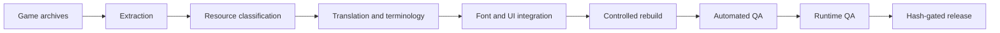

# Architecture

The private project used a layered workflow rather than treating localization as one text table.

## Game-specific adapters

The private implementation included archive, compressed-resource, Scaleform/GFX, font, and audio-slot adapters. Those implementations are tied to Prototype's proprietary formats and are not included here.

## Reusable validation layer

The public reference tools focus on methods that can be expressed without game assets:

- placeholder, markup, and control-code preservation;
- player-visible English classification;
- field-to-font glyph coverage;
- allowlisted resource-manifest comparison;
- SHA-256 manifest verification.

These are small reference implementations with synthetic input contracts, not a claim of cross-game compatibility. A real integration still needs a lawful adapter that emits the neutral JSON structures described by each tool.
